# 🏕️ Scouts Management System

A modular **Odoo 18** application designed to digitalize and simplify the management of Scout organizations.  
The system enables administrators and leaders to manage members, organize activities, and track progress within a structured and secure environment.

---

## 🎯 Overview

The **Scouts Management System** provides an all-in-one platform for managing scout troops, leaders, events, and achievements.  
It aims to reduce manual paperwork and improve transparency across scouting operations — from attendance tracking to badge assignment.

---

## 👥 Roles & Permissions

| Role | Description | Key Responsibilities |
|------|--------------|----------------------|
| **Administrator** | Full-access system manager. | - Configure global settings<br>- Manage users, leaders, and scouts<br>- Oversee all modules and reports |
| **Leader** | Supervisor of a troop or group of scouts. | - Register new scouts<br>- Create and manage events<br>- Record attendance and achievements |
| **Scout** | Registered member of a troop. | - View assigned activities<br>- Track earned badges<br>- Update limited personal information |
| **Parent (optional)** | Linked to one or more scouts. | - View child’s activities and performance reports |

---

## ⚙️ Core Features

| Module | Description |
|---------|--------------|
| **Member Management** | Maintain detailed records of scouts and leaders, including contact information, age, rank, and troop assignment. |
| **Troop / Group Management** | Organize scouts into hierarchical structures for easier supervision and reporting. |
| **Event Management** | Schedule, manage, and record attendance for meetings, camps, and community events. |
| **Badge & Achievement Tracking** | Define badge criteria and track scout progress toward earning them. |
| **Attendance & Performance Reports** | Generate reports for participation, ranking, and overall progress metrics. |

---

## 🧭 Roadmap

| Phase | Description | Status |
|--------|--------------|--------|
| **Phase 1** | Define module structure and core data models (scouts, leaders, events). | 🟢 In Progress |
| **Phase 2** | Implement CRUD operations and Odoo views. | ⏳ Planned |
| **Phase 3** | Add badges, attendance tracking, and reports. | ⏳ Planned |
| **Phase 4** | Integrate notifications, dashboard, and permissions. | ⏳ Planned |

---

## 🧰 Tech Stack

| Layer | Technology |
|--------|-------------|
| **Framework** | Odoo 18 |
| **Language** | Python 3 |
| **Database** | PostgreSQL |
| **Version Control** | Git & GitHub |
| **IDE** | PyCharm |
| **Hosting (optional)** | Odoo.sh / Local deployment |

---

## 💡 Objectives

- Deliver a real-world, open-source learning project for Odoo developers.  
- Apply best practices in modular design, security, and version control.  
- Enable easy customization and scalability for different scouting organizations.

---

## 🪶 License

This project is licensed under the **MIT License** — see the [LICENSE](LICENSE) file for details.

---

## 🤝 Contributing

Contributions are welcome!  
Please fork the repository and submit a pull request with clear commit messages.  
Bug reports and feature suggestions can be opened via [GitHub Issues](../../issues).

---

## 🔄 Development Workflow

Below is the typical contribution flow for this project:

```mermaid
graph TD
    A[Fork the Repository] --> B[Clone to Local Machine]
    B --> C[Create New Branch: feature/your-feature]
    C --> D[Make Changes & Commit]
    D --> E[Push Branch to Your Fork]
    E --> F[Open Pull Request to dev Branch]
    F --> G[Code Review & Feedback]
    G --> H[Approved → Merge into dev]
    H --> I[Maintainer merges dev → main for release]

```


---

## 🧰 2. Add Your Files

```markdown
# 🛠️ Contribution Guidelines

Thank you for your interest in contributing to the **Odoo Scouts Management System** project!

## 💡 How to Contribute

1. **Fork** this repository  
2. **Clone** your fork to your local machine:
   ```bash
   git clone https://github.com/YOUR_USERNAME/odoo-scouts-management.git

```

---

## 🚀 3. Push Your Updated Files to GitHub

```bash
# Make sure you're on the correct branch
git branch

# If you’re still on main, switch to dev (or create it)
git checkout -b dev

# Stage your new files
git add README.md CONTRIBUTING.md

# Commit with a clear message
git commit -m "Add contribution guidelines and workflow diagram"

# Push to your remote dev branch
git push -u origin dev
```
---
## 📬 Contact

**Author:** Mossab ([@dimandz](https://github.com/dimandz))  
**Project Link:** [https://github.com/dimandz/odoo-scouts-management](https://github.com/dimandz/odoo-scouts-management)
